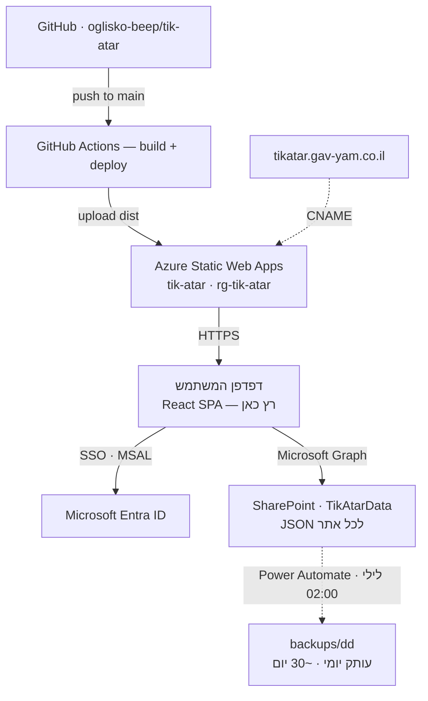

# תיק אתר — מסמך תשתית (Infrastructure)

מסמך תפעולי ל‑IT: היכן המערכת רצה, ממה היא מורכבת, ואיך לתחזק/לשחזר.

> **מזהים רגישים** (clientId, tenantId, מזהה מנוי, טוקן פריסה) **אינם במסמך זה** — הריפו ציבורי. הם נמצאים ב‑`app/.env` (מקומי, gitignored), ב‑GitHub repo secrets, ובפורטלים של Azure/Entra. ריכוז שלהם נמצא בפתק הפרטי `INFRA-SECRETS.local.md` (לא נשמר ב‑git) — שמרו אותו בכספת/מאגר פנימי.

---

## 1. סקירה

אפליקציית **React 18 + Vite + TypeScript** — SPA סטטית שרצה **בדפדפן** של המשתמש. אין שרת אפליקציה ואין בסיס נתונים לתחזק ("serverless"): הפרונטאנד מתארח ב‑Azure, ההתחברות דרך Microsoft Entra ID, והנתונים נשמרים ישירות ב‑SharePoint דרך Microsoft Graph.

| רכיב | היכן |
|------|------|
| כתובת ראשית | **https://tikatar.gav-yam.co.il** |
| כתובת Azure (ברירת מחדל) | https://icy-ground-0f57e4e03.7.azurestaticapps.net |
| קוד מקור | https://github.com/oglisko-beep/tik-atar |
| אירוח | Azure Static Web Apps |
| התחברות | Microsoft Entra ID (SSO) |
| נתונים | SharePoint — ספריית `TikAtarData` |
| CI/CD | GitHub Actions (פריסה אוטומטית) |

### דיאגרמת ארכיטקטורה



---

## 2. אירוח — Azure Static Web Apps

| פרט | ערך |
|------|------|
| שם המשאב (SWA) | `tik-atar` |
| קבוצת משאבים | `rg-tik-atar` |
| אזור | West Europe (Amsterdam) |
| Hostname ברירת מחדל | `icy-ground-0f57e4e03.7.azurestaticapps.net` |
| מזהה מנוי / Resource ID | ראו פתק פרטי |

הבנייה מתבצעת ב‑GitHub Actions (Oryx כבוי — מעלים `app/dist` מוכן). קובצי תצורה: `app/public/staticwebapp.config.json` (CSP `frame-ancestors` ל‑SharePoint, ניתוב SPA fallback).

---

## 3. התחברות — Microsoft Entra ID

- רישום אפליקציה מסוג **SPA (Authorization Code + PKCE)**, חד‑דיירי (`AzureADMyOrg`).
- **הרשאות (delegated):** `Sites.ReadWrite.All` + `User.Read` — **הסכמת מנהל ניתנה לכל הארגון** (AllPrincipals). אף משתמש לא רואה חלון הסכמה.
- **Redirect URIs (SPA):**
  - `https://tikatar.gav-yam.co.il/`
  - `https://icy-ground-0f57e4e03.7.azurestaticapps.net/`
  - `http://localhost:5173/` (פיתוח)
- MSAL רץ בדפדפן; `redirectUri` = `window.location.origin + '/'`.
- clientId / tenantId / Object ID של האפליקציה — בפתק הפרטי.

**להוספת כתובת חדשה (redirect URI):** Entra → App registrations → האפליקציה → Authentication → Single-page application → Add URI.

---

## 4. נתונים — SharePoint

| פרט | ערך |
|------|------|
| אתר | `gavyamcoil1.sharepoint.com/sites/GavYamPortal/IT` |
| ספרייה | `TikAtarData` |
| מבנה | קובץ **JSON לכל אתר** (תיק) |
| גישה | Microsoft Graph מהדפדפן (delegated — כל משתמש בשמו) |

**מודל הרשאות עריכה:** נקבע על‑ידי הרשאות ה‑SharePoint על הספרייה, לא על‑ידי האפליקציה. המודל הנבחר: **קבוצה מורשית עורכת, כל השאר קריאה בלבד**. משתמש בלי הרשאת כתיבה → שמירה מחזירה 403 → האפליקציה נועלת עריכה ומציגה "צפייה בלבד".

**להוספת/הסרת עורך:** ספריית `TikAtarData` → Settings → *Library settings* → *Permissions* → *Stop Inheriting Permissions* → קבוצת Members = **Read**, קבוצת העורכים (או משתמש) = **Edit/Contribute** (*Grant Permissions*).

**גיבוי/שחזור נתונים:** שלוש שכבות — (1) **גיבוי לילי אוטומטי** דרך Power Automate: כל לילה ב‑02:00 מעתיק את כל קובצי ה‑JSON ל‑`backups/<יום‑בחודש>/` באותה ספרייה (רוטציה ~30 יום, נדרס אוטומטית). הקמה: [`docs/BACKUP-SETUP.md`](BACKUP-SETUP.md). (2) **היסטוריית גרסאות** לכל קובץ + סל מיחזור של SharePoint. (3) **ייצוא/ייבוא JSON** ידני מהאפליקציה (תפריט ⋯).

---

## 5. DNS

`tikatar.gav-yam.co.il` → **CNAME** → `icy-ground-0f57e4e03.7.azurestaticapps.net`

- **ציבורי (סמכותי):** NetVision (`dns/nypop/eupop.netvision.net.il`) — מנוהל דרך תמיכת NetVision.
- **פנימי:** שרת Windows DNS `TOHA-1` (אזור `gav-yam.co.il`) — **split‑brain**, לכן הרשומה קיימת בשני המקומות לאותו יעד.
- **SSL:** מונפק ומתחדש אוטומטית על‑ידי Azure.

**להוספת דומיין מותאם ב‑Azure:** SWA → Custom domains → Add → הזן את השם → Azure מאמת מול ה‑DNS הציבורי ומנפיק SSL. חובה שהרשומה תהיה ב‑DNS **הציבורי**.

---

## 6. CI/CD — GitHub Actions

- Workflow: `.github/workflows/azure-static-web-apps-icy-ground-0f57e4e03.yml`
- **טריגר:** `push` לענף `main` (וגם PRs).
- **זרימה:** `npm ci` → כותב `app/.env` מ‑repo secrets → `npm run build` → מעלה `app/dist` ל‑Azure SWA.
- **Repo secrets (GitHub → Settings → Secrets and variables → Actions):**
  - `VITE_AAD_CLIENT_ID`
  - `VITE_AAD_TENANT_ID`
  - `AZURE_STATIC_WEB_APPS_API_TOKEN_ICY_GROUND_0F57E4E03` (טוקן הפריסה של ה‑SWA)

**לפרוס שינוי:** פשוט `git push` ל‑main → ה‑Action בונה ופורס תוך ~1–2 דקות. אין פעולה ידנית ב‑Azure.

**לשחזר/לפרוס מחדש:** הריפו הוא מקור האמת. הרצה מחדש של ה‑Action (Re‑run) בונה ומעלה מחדש. אם צריך טוקן פריסה חדש: SWA → *Manage deployment token* → עדכן את ה‑secret.

---

## 7. פיתוח מקומי

```bash
git clone https://github.com/oglisko-beep/tik-atar.git
cd tik-atar/app
npm ci
# צור app/.env עם VITE_AAD_CLIENT_ID / VITE_AAD_TENANT_ID / VITE_SP_SITE / VITE_SP_LIBRARY
#   (הערכים בפתק הפרטי INFRA-SECRETS.local.md)
npm run dev      # http://localhost:5173
npm run test     # בדיקות (Vitest)
npm run build    # בנייה ל-app/dist
```

Node 20+. `app/.env` הוא **gitignored** — לעולם לא נכנס ל‑git.

---

## 8. יכולות המערכת (למי ששואל "מה זה עושה")

תיק אתר אינטראקטיבי ל‑IT: 10 פרקים (ציוד קצה, רשת ושרתים, אבטחת מידע, סייבר, התאוששות מאסון (DR), ספקים, אנשי קשר, נספחים ועוד) · ריבוי אתרים · אחוז השלמה · חיפוש · יצוא PDF/Word · צירוף קבצים (תמונות, Visio, PDF) · **בחירת פרקים/תתי‑פרקים ועמודות לכל אתר** · **דשבורד מנהלים** חוצה‑אתרים · מצב משותף עם SSO והרשאות עריכה דרך SharePoint.

---

## 9. מדיניות אבטחה

- **מזהי הארגון (clientId, tenantId) לעולם לא נשמרים בריפו הציבורי.** הם ב‑`app/.env` (מקומי) וב‑GitHub secrets בלבד; מוזרקים בזמן build דרך Vite `define`.
- הנתונים נשארים בתוך ה‑SharePoint הארגוני — לא אצל צד שלישי.
- אין לשמור סיסמאות/מפתחות בתוך תוכן התיק (יש התראה על כך בנספחים).

---

## 10. נהלי תקלות ושחזור (Incident & Recovery)

### טריאז' מהיר — תסמין ← סיבה ← פעולה

| תסמין | סיבה סבירה | פעולה |
|-------|-----------|-------|
| האתר לא נטען / "404 Web Site not found" | פריסה נכשלה, או DNS/דומיין | GitHub → Actions (לוג הריצה); ודא שהדומיין `Ready` ב‑SWA; Ctrl+Shift+R |
| התחברות נכשלת · `AADSTS50011` | Redirect URI לא רשום לכתובת שבשימוש | Entra → App registration → Authentication → הוסף את הכתובת (`origin + /`) |
| לחיצה על "התחבר" לא עושה כלום | דגל `interaction_in_progress` תקוע | חלון פרטי / ניקוי אחסון דפדפן (האפליקציה גם מתאוששת אוטומטית) |
| חזר מ‑Microsoft אך לא מחובר | הסכמת מנהל / scope חסר | ודא admin consent ל‑`Sites.ReadWrite.All` (Entra → API permissions) |
| נתונים לא נשמרים · "צפייה בלבד" לא צפוי | 403 — אין הרשאת כתיבה בספרייה | תקן הרשאות `TikAtarData` (עורך/קבוצה = Edit) |
| נתונים נמחקו / שוכתבו | טעות עריכה / conflict | שחזר מ‑Version History של הקובץ ב‑SharePoint, או ייבא גיבוי JSON |
| דומיין/SSL לא עובד | CNAME לא התפשט / אימות | `nslookup tikatar.gav-yam.co.il 8.8.8.8`; ודא רשומה ב‑NetVision; דומיין `Ready` ב‑SWA |

### פריסה נכשלה / פריסה מחדש
1. GitHub → **Actions** → פתח את הריצה האחרונה של *Azure Static Web Apps CI/CD*.
2. אם נכשלה — קרא את הלוג (בד"כ שלב ה‑build). תקן ו‑`git push`, או **Re‑run jobs**.
3. הריפו הוא מקור האמת — כל `push` ל‑main בונה ופורס מחדש (~1–2 דק').

### טוקן פריסה אבד / הוחלף
Azure Portal → SWA `tik-atar` → **Manage deployment token** → *Reset* → העתק → עדכן את ה‑secret `AZURE_STATIC_WEB_APPS_API_TOKEN_ICY_GROUND_0F57E4E03` ב‑GitHub → הרץ Action מחדש.

### שחזור נתונים (SharePoint)
- **מגיבוי לילי:** `TikAtarData/backups/<יום‑בחודש>/` → הורד את `{code}.json` הרצוי → העלה לשורש `TikAtarData` (או ייבא באפליקציה). ראה [`docs/BACKUP-SETUP.md`](BACKUP-SETUP.md).
- **קובץ בודד:** ספריית `TikAtarData` → הקובץ → **Version History** → שחזר גרסה. אם נמחק — **סל מיחזור**.
- **גיבוי יזום:** באפליקציה, תפריט ⋯ → **ייצוא כל האתרים (JSON)** — שמור עותק תקופתי. שחזור: ⋯ → **ייבוא מקובץ JSON**.

### שחזור מלא (Disaster Recovery)
הנתונים (SharePoint) וההתחברות (Entra) **בלתי‑תלויים באירוח** — גם אם ה‑SWA נמחק, הנתונים בטוחים. לשחזור מלא:
1. שחזר את הסודות מהכספת (`INFRA-SECRETS.local.md`).
2. אם ה‑SWA נמחק — צור/שחזר SWA, עדכן את ה‑secret של טוקן הפריסה, ופרוס מ‑GitHub.
3. עדכן CNAME / redirect URIs אם הכתובת השתנתה.
4. הרץ את ה‑Action → האתר חוזר לאוויר; הנתונים כבר ב‑SharePoint.

### אנשי קשר / הסלמה
| נושא | גורם |
|------|------|
| DNS ציבורי (gav-yam.co.il) | תמיכת **NetVision** |
| DNS פנימי | צוות IT — שרת `TOHA-1` |
| Azure (SWA, מנוי) | מנהל Azure בארגון |
| Entra (app, consent, הרשאות) | מנהל Entra / Global Admin |
| SharePoint (הרשאות ספרייה) | מנהל האתר `GavYamPortal/IT` |
